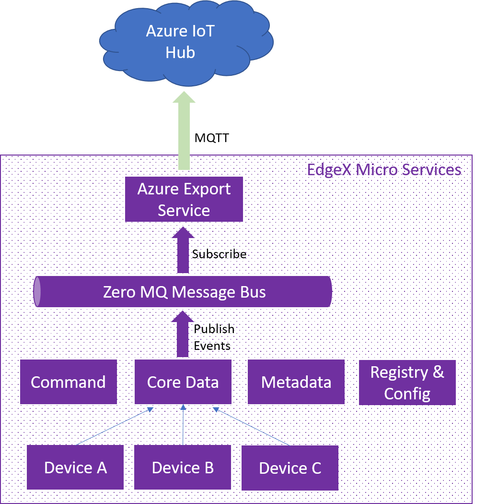

# Azure Export Service #

#### Overview ####

Many IoT deployments require some form of integration with the cloud. The integration will be required for both north- and south-bound services. For north-bound services, data is exported from the device to the cloud for analytics or further processing. This document demonstrates a sample EdgeX application service – the Azure Export Service – that consumes the device data and exports the readings to the Azure IoT Hub.  The entire technical architecture is illustrated below:



#### Prerequisites ####

* Obtain the code from the https://github.com/edgexfoundry-holding/app-service-examples repo
* Ensure that EdgeX is running with mandatory services, including core services and logging service
* Ensure that the Virtual Device Service is running and managed by EdgeX with at least one pre-defined device, such as Random-Boolean-Device<br>

If you are unfamiliar with the Azure IoT Hub, read the following documents first, as this document intentionally omits some details on Azure:
* [Create an Azure IoT Hub on the Azure portal](https://docs.microsoft.com/en-us/azure/iot-hub/iot-hub-create-through-portal)
* [Set up X.509 security on Azure IoT Hub](https://docs.microsoft.com/en-us/azure/iot-hub/iot-hub-security-x509-get-started)

#### Steps ####

1. In the code obtained from the https://github.com/edgexfoundry-holding/app-service-examples repo, update the [app-services/app-functions-azure/examples/azure-export/res/configuration.toml](./examples/azure-export/res/configuration.toml) with the following values:<br>
    ```
     [ApplicationSettings]
     IoTHub         = "EdgeX"
     IoTDevice      = "MyDevice"
     MQTTCert       = "/secret/rsa_cert.pem"
     MQTTKey        = "/secret/rsa_private.pem"
     TokenPath      = "/secret/resp-init.json"
     VaultHost      = "localhost"
     VaultPort      = "8200"
     CertPath       = "v1/secret/edgex/pki/tls/azure"
     DeviceNames    = "Random-Integer-Device"
    ``` 
   Where:
   - `IoTHub` is the name of your Azure IoT hub, which can be found in the Azure Portal. 
   - `IoTDevice` is the ID of your IoT device created on the Azure IoT Hub, which can be found in the Azure Portal.  **Note:** The thumbprint of this device must be associated with the cert/key specified in `MQTTCert`/`MQTTKey` or `CertPath`.
   - `DeviceNames` are the devices managed by EdgeX in a comma-separated list if specifying multiple devices.  To simplify the process, this sample service only uses the [Random-Integer-Device as pre-defined in virtual device](https://github.com/edgexfoundry/device-virtual-go).
   - `MQTTCert` is the location of the certificate used to register with the Azure IoT Hub. This location must be accessible to your Azure Export Service. 
   - `MQTTKey`  is the location of the private key used to register with the Azure IoT Hub. This location must be accessible to your Azure Export Service.
   - `VaultHost` is the host of the vault secret store.
   - `VaultPort` is the port number of the vault secret store.
   - `CertPath` is the path to the certificate in the vault secret store.
   - `TokenPath` is the vault token file used to access the [vault secret store integrated with EdgeX](https://docs.edgexfoundry.org/Ch-SecretStore.html).  This location must be accessible to your Azure Export Service. To simplify the process, copy the resp-init.json from edgex-vault service using the following command:<br>
     ```
     docker exec -it edgex-vault cat /vault/config/assets/resp-init.json > /secret/resp-init.json
     ```
2. As the Azure IoT Hub requires secured communication using MQTT over TLS, we need a key/certificate pair to connect to the cloud, and as mentioned in the Prerequisites, you need the X.509 certificate and private key. The Azure Export Service provides two methods to configure the key/cert pair. By default, the service tries to retrieve the pair from vault:
   * Ensure that the `VaultHost` and `VaultPort` values point to the vault in your environment
   * Mount the /vault volume in your container with a resp-init.json available at `TokenPath`. This can be done by mounting the vault-config volume in the [EdgeX docker-compose yml file](https://github.com/edgexfoundry/developer-scripts/blob/master/releases/edinburgh/compose-files/docker-compose-edinburgh-1.0.1.yml)
   * Create the cert and key properties as secret at `CertPath` in vault. You can do this through Vault's web GUI at https://localhost:8200/ui/vault. To login to the GUI, you must obtain the value of "root_token" from the file pointed to by `TokenPath` in vault, for example:<br>
     ```
     $ docker exec -it edgex-vault cat /vault/config/assets/resp-init.json
     {
         "keys":[
             "e8c978b432a8d56316099d3080312807f53cd4cbadb15f694b010692370e0ea67d",
             "a6178d0083b42d8087ab6b973064f3e5db3d605bc68f108c2d1b96994016cec122",
             "de5d71bce76ceb095f40a91b67d822caa129f5659bff846903edc8af21c2be28d0",
             "4e235454a292587d4e747472a1fa333305be944c6a9605108ff1835689c2e66639",
             "90ec3e64211c2a88ee894b5c05c6954360915085daf006744926d045a6ff62ad7b"
         ],"keys_base64":[
             "6Ml4tDKo1WMWCZ0wgDEoB/U81MutsV9pSwEGkjcODqZ9",
             "pheNAIO0LYCHq2uXMGTz5ds9YFvGjxCMLRuWmUAWzsEi",
             "3l1xvOds6wlfQKkbZ9giyqEp9WWb/4RpA+3IryHCvijQ",
             "TiNUVKKSWH1OdHRyofozMwW+lExqlgUQj/GDVonC5mY5",
             "kOw+ZCEcKojuiUtcBcaVQ2CRUIXa8AZ0SSbQRab/Yq17"
         ],"root_token":"s.XFCm3oYjO5BGzKA8yd31D2GW"
     }
     ```
   * In the Vault's web GUI, under **secrets**, navigate to **edgex/pki/tls** and create a secret called **azure**
   * In the Vault's web GUI, create two key/value pairs, **Cert** and **Key**, under **edgex/pki/tls/azure**.  The values for **Cert** and **Key** are the actual key and certificate in pem format, and must be the key/cert that you previously configured in the Azure IoT Hub. This example uses the default secret path defined in `CertPath`, you can create a different secret and change `CertPath` accordingly. If configured properly, the Azure Export Service can retrieve the key/cert pair and establish a connection to the Azure IoT Hub. If the service fails to retrieve the key/cert from vault, it will fall back to use key/cert files from the local file system configured in `MQTTCert` and `MQTTKey`. At this point, the Azure IoT hub is configured.
3. Build the Azure Export service through steps as described [here](https://github.com/edgexfoundry-holding/app-service-examples#building-examples)
4. Run the Azure Export service through steps as described [here](https://github.com/edgexfoundry-holding/app-service-examples#running-an-example), and the Azure Export Service is exporting readings to the Azure IoT Hub at this point
5. To see if your Azure IoT Hub receives the exported readings from EdgeX, use the **Azure IoT Tools** extension in Visual Studio Code to monitor messages from the device as follows:
   * Download and Install [Visual Studio Code](https://code.visualstudio.com/)
   * Launch Visual Studio Code
   * Install the Azure IoT Tools extension
   * Press **Ctrl** + **Shift** + **P**  to open the Command Palette
   * Enter **Azure: Select Subscriptions**
   * Select your **subscription** > **IoT Hub**, Devices display in the Azure IOT HUB tab on the left side.
   * Right-click **Device ID**
   * Select **Start Monitoring Built-in Event Endpoint**. The incoming event is displayed in the Output tab